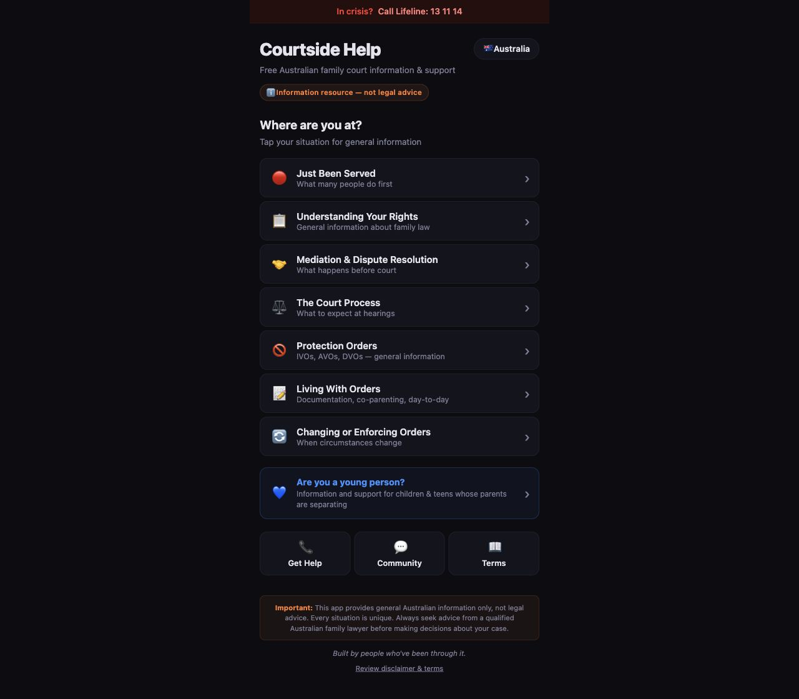
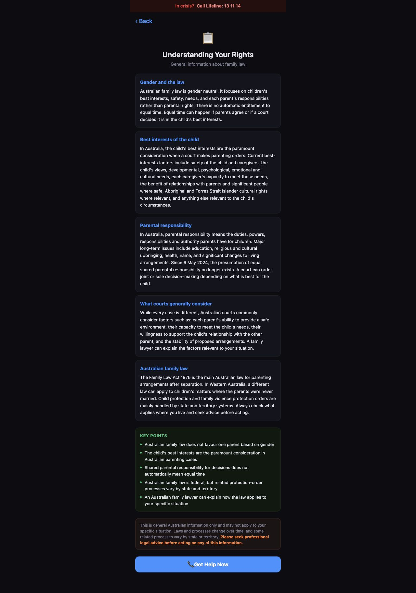
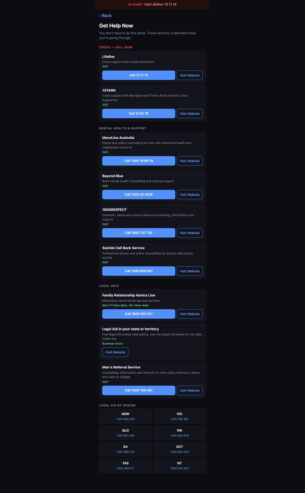

# Courtside Help

Courtside Help is a mobile-first Australian family violence and family court information guide for applicants, respondents, people who have been served, people seeking protection, and families trying to understand parenting arrangements or urgent next steps.

It is designed to reduce confusion, not replace professional advice. The app gives plain-language general information, Australian support contacts, crisis links, youth support, legal terminology, and lived-experience style navigation for common moments involving family violence orders, family court, separation, safety concerns, and parenting disputes.

**Live demo:** https://fineartmedia.tech/courtside/

## Screenshots

<p>
  
  
  
</p>

## What It Includes

- Australia-only launch experience with no country picker.
- Crisis banner with immediate Australian crisis support.
- Stage-based navigation for common family violence and family court moments.
- Plain-language Australian parenting-law information.
- Get Help directory for crisis, mental health, family violence and legal support.
- Legal terms glossary for common court language.
- Youth support page for children and teenagers affected by separation.
- Disclaimer and safety language throughout the app.

## Current Scope

The current release is intentionally focused on Australia. Country selection has been removed so people in stressful situations are not asked to make an unnecessary jurisdiction choice.

The guide is general information only. It is not legal advice, a crisis service, counselling, or a substitute for advice from a qualified Australian family lawyer.

## Tech Stack

- React
- Vite
- GitHub Pages
- GitHub Actions deployment

## Local Development

```bash
npm install
npm run dev
```

## Checks

```bash
npm run lint
npm run build
```

## Deployment

The demo is deployed with GitHub Actions and GitHub Pages. The workflow is defined in:

```text
.github/workflows/deploy.yml
```

On push, the workflow installs dependencies, runs lint, builds the Vite app, uploads the `dist` artifact, and deploys it to GitHub Pages.

## Content Safety

Courtside Help should stay cautious, non-directive and non-advisory. Content should:

- Explain general processes without telling people what to do in their case.
- Encourage qualified legal advice before decisions.
- Avoid promising outcomes or timelines.
- Prefer official Australian sources for legal and support-service facts.
- Treat crisis and family violence information with particular care.
